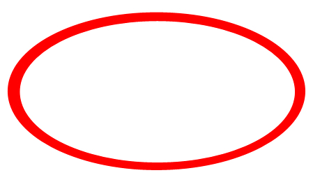

# Introduction to Git and Version Control.

This tutorial is targeted towards the students of Founders & Coders 8 week coding Academy. Feedback or Suggestions (raised in an issue) or contributions (a pull request) are welcome and appreciated. 

# Contents
#### Introduction
1. Need to Know Terminology
2. Why Version Control
3. Basic Commands
//To begin, Please fork this repository 
4. Introducing Github Flow
5. how to deal with a merge conflict

#### In Practice
- What you will need to get competent at by the end of the 8th week

1. More about feature branches
2. What is a commit?
3. About commit messages
4. When to add and commit?
5. How to merge commits together --> complex git 

# Introduction

This introduction to Git is aimed at first week students of [Founders & Coders](http://foundersandcoders.org/) 8 week coding academy. The hope is that this introduction will cover all you need to know to start collaborating on code with your fellow teammates. 

## 1. Terminology

*Repository (repo)*
Simply put, this is your project folder. This repository can be located locally (in your file system on your computer), or remotely (on Github). Either way, it is the same repository.

*Version Control*
We will use Git for this. A way of keeping track of changes in the code which makes it possible to work with multiple developers on the same repo.

*Git*
A version control system.

*Github*
A remote location where you can store you code, and which all the members of the team have access to. Think of it like a dropbox for code. One of the big differences however is most repositories on github are public. Anybody can see your code.

*Commit*
A way of saving your code at different points along the project. Unlike many tools you may have used however, all commits are saved. This creates a project history and a way to track changes. 

*Branches*
As you work on a git repo the first branch you are on is usually the default branch. This is often called `master`. If you start working on a section of the website (say the footer styling), it is best practise to create your own branch for that feature. Creating your own branch is like taking a copy of `master` and renaming it. When you commit, they will now be on that new branch only. 

In the sections below we will walk through how to do this. For the meantime, just note that you always have one default branch, and can have as many other branches as needed.

## 1. Why Version Control

#### Code Base History
Git can provide you with a complete history of every commit made on a project. Benefits include:

	* Being able to see what differences to the file system you have made before you have commited.

	* Being able to see what differences exist between commits

	* Being able to move between difference commits (or places in time). This is especially useful if something became broken while you were working on it, and you need to start again.

In the introduction section of this tutorial, we won't be able to cover all these benefits in practise extensively. However, we will aim to give you all the information you will need to know by the end.

#### Multiple people working on the same files
Version control makes this possible. If you work on one file, and then I work on the same file at the same time when we want to combine our changes git allows us to keep both versions save that we can compare. This allows us to integrate our changes more swiftly. 

We will practice with this later.

#### Branching
A good work flow with git always involves branching. Having branches helps organise the code, and keep track of who is working on what.

## 3. Basic Commands

Before we start, if you don't have a Github account, please get one. 

Next please fork this repository. 

On your local machine, please make sure you have git installed. If you are using a mac, please install with [brew](http://brew.sh/). 

Windows installation?
Linux installation?

TODO: 
-clone repo
-ssh or git config?
- git status
- git add 
- git commit -m 
- git commit -am
- git push
- git branch
- git merge.

RESOURCES:

http://gitreal.codeschool.com/
https://www.atlassian.com/git/tutorials/